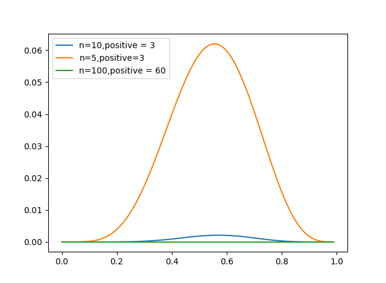

# problem 2

1.  

$$
\begin{aligned}
L(\theta) &= \prod \theta^{X_i}(1- \theta) ^{1-X_i}\\
&= \theta^{\sum X_i}(1-\theta)^{n-\sum X_i}
\end{aligned}
$$

2.  

    [code](./hw2.py)

    

3.  

$$
\begin{aligned}
Ln\ L(\theta) &= ln\ \theta\sum X_i +(n - \sum X_i)ln(1-\theta)\\
\frac{\partial Ln\ L(\theta)}{\partial \theta} &= \frac{\sum X_i}{\theta} + -1\frac{n - \sum X_i}{1 - \theta}  = 0\\
\theta& = \frac{\sum X_i}{\theta} = 0.6
\end{aligned}
$$

4.  
   
   

# problem 3

