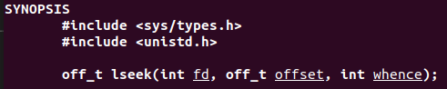
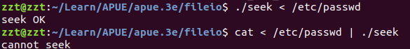
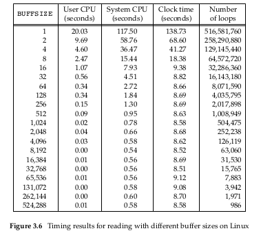
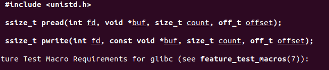
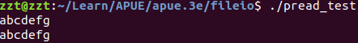
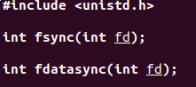

> author ： fighter(zzt)
> 
> edit date: 10/18/2018
> 
> License: 转载请注明出处 :)


# File IO

5个函数 , ```open, read, write, lseek,close```

特点: 

1. unbuffered IO, ```read, write,``` 每次都调系统调用
2. POSIX.1 标准

## File Descriptor (fd)

1. 每个 **fd** 对应一个整数，
2. fd的范围 是 0-OPEN_MAX - 1 ，
3. 每个fd对应一个打开的文件
4. 默认 0,1,2, 分别对应 stdin,stdout,stderr, 即符号常量：STDIN_FILENO, STDOUT_FILENO, STDERR_FILENO， defined in <unistd.h>（unix std lib）

## open & openat & create

因为书籍太老(13year ed),我以linux 开发手册为标准


1. ```open``` 是系统调用的封装，这点可以在linux 系统源码中查到
2. **flags** 标志，通常是读写权限标志，
3. **mode_t** 权限标志，描述文件的访问权限(? **待解决**)
4. 如果文件打开成功，返回最小可用 ```fd```, 否则-1

**open 区别于openat** 的地方：

主要在那个 ```dirfd``` 

1. ```path``` 是绝对地址，dirfd被忽略掉
2. ```dirfd``` 为 AT_FDCWD, 表明 工作目录是相对路径
3. ```dirfd``` 为 path相对路径的参考目录，即最终路径是 ```fd/path```

**引入```openat```出于两个优势**：

1. 给予 thread 能够打开非当前目录为参考目录的方式
2. 避免 TOCTTOU,(个人理解是，先切到一个目录，然后再代开文件，非原子操作，很容易造成同步错误)

**creat**

等价于

> ```open(path, O_WRONLY|O_CREAT|O_TRUNC,mode)```

不过这样打开的文件没有读权限，更方便的方式是:

>  ```open(path, O_RDWR|O_CREAT|O_TRUNC,mode)```

## close

略过

关闭打开的文件，释放fd，不过进程结束都会关闭所有打开的文件


## lseek



1. 每个文件都与一个 "current file offset" 变量向关联，读写都是从文件的这个位置开始的，lseek就是改变文件的cfoff, 便返回。
2. 参数 ```whence``` 指明偏移的基址(即，cfoff = ret = whence+ offset);
3. 这个函数没有**IO**

参数 **whence**：

- SEEK_SET： begin of File
- SEEK_CUR:  current offset of file
- SEEK_END: end of file

**trick**

1. 查看 "cur offset"

```c++
off_t currpos = lseek(fd,0,SEEK_CUR)
```

这个trick 也能够确定某个文件是否可以seek, pipe,socket 是不能seek的，这时候会返回 -1

example https://github.com/DylanFrank/Learn/blob/master/APUE/apue.3e/fileio/seek.c

```c++
#include "apue.h"

int
main(void)
{
	if (lseek(STDIN_FILENO, 0, SEEK_CUR) !=-1)
		printf("cannot seek\n");
	else
		printf("seek OK\n");
	exit(0);
}
```



**个人注:**

>这个 "./seek < /etc/passwd", 的意思是，shell打开 file “/etc/passwd”, 然后将STDIN 重定向到 这个file，即 seek.c中的 fd STDIN_FILENO, 被重定向到了 "/etc/passwd", 第二个例子同，将pipe重定向到 STDIN_FILENO, 所以STDIN_FILENO 这个文件描述符其实这时候对应的是 一个管道

2. hole

这个例子   https://github.com/DylanFrank/Learn/blob/master/APUE/apue.3e/fileio/hole.c

说明:
-  lseek 到的下一个位置可以超出整个文件，这个时候下一次写就写到超出的地方，而中间(old file end - cur) 这之之间就形成一个 hole, hole 不占用具体磁盘块，读到这之间的都返回


## read

> ```ssize_t read(int fd, void *buf, size_t count);```

return 真实读到的字节数目，-1,ERR

1. count 想要读取的字节数，(不一定每次都能读到这么多，e.g. 文件，没这么长)

## write

与read 类似


## IO Efficience

这里主要想说明的是 IO 的读写策略和 BUFFSIZE 是非常相关的



**注** 影响IO 的因素很多，学过计算机系统的都知道，io 磁盘及内存缓存策略非常相关


## file share

这个需要了解内核中的文件数据结构，强烈推荐这篇文章 [USNA 系统编程讲义，文件系统，内核数据结构](https://www.usna.edu/Users/cs/aviv/classes/ic221/s16/lec/21/lec.html)

或者我的中文翻译 [USNA 系统编程讲义，文件系统，内核数据结构](https://blog.csdn.net/Dylan_Frank/article/details/83216050)

## Atomic Operations

如果没有 O_APPEND 标志， 那么添加字符到文件末尾，是这样的

```cpp
if(lseek(fd,0,2) < 0)
    err_sys("lseek err!");
if(write(fd, buf, 100) != 100)
    err_sys("write err");
```
这两个系统调用不是 原子的，所以如果进程在者之间切换，就会发生很多奇妙的事情了，所以，APUE 建议用 ```O_APPEND``` 

### pread & pwrite



类似 lseek 之后再调用 read ，不过有两点不同:

1. 整个过程是原子的
2. ```curr file offset``` 不会改变

**example**

```cpp
#include <unistd.h>
#include <stdio.h>


int main(int argc, char const *argv[]) {
    char *buf = "abcdefg\n";

    pwrite(STDOUT_FILENO, buf, 9, 0);
    //offset not change
    write(STDOUT_FILENO, buf,9);// offset change
    write(STDOUT_FILENO, buf,9);
    return 0;
}
```



**个人总结：**

这节核心是告诉我们涉及内核系统调用的时候一定要注意原子操作，然后给出了一些具体的trick，我相信这些trick在具体工作的时候会被慢慢发觉，没必要特意去记忆

## dup & dup2


这个复制文件的内核数据结构改变是非常重要的，这个也在 file share 那一节中讲了。

1.  dup 用lowest fd 复制 oldfd
2.  dup2 先关闭newfd, 然后在复制oldfd到 newfd;是原子的

dup2 等价于:

1. close(newfd)
2. fcntl(fd,F_DUPFD, newfd)

**注** ```fcntl``` 是操控文件描述符表和文件表状态的一个函数，跳过不说

## 缓冲区冲刷函数

学过操作系统的都知道，内核会建立写缓冲，并不会修改了文件后就立即写入磁盘。而缓冲区通常是会被复用的（不是一个文件一直用一个缓冲区） ，为确保修改的数据被写到磁盘，内核给出了下面这些系统调用



加上 ```void sync(void)```

这个函数是将修改的块缓冲放入写等待队列，然后就返回，不会等到写完成才返回。同常后台的守护进程，每个30sec 就会调用这个函数

```fsync``` 看名字就知道将对应文件块的缓冲冲刷，通常在数据库修改的时候会特别有用，会等到写完成才返回

```fdatasync``` 这个函数只会冲刷数据，而上一个函数还会冲刷文件属性


## sumary

1. 剩下一个 3.2 exe 待写
2. 3.4 疑问， 这个 fd> 2 ， 0,1,2,3 都是指向同一个文件表吧 . (待查证)