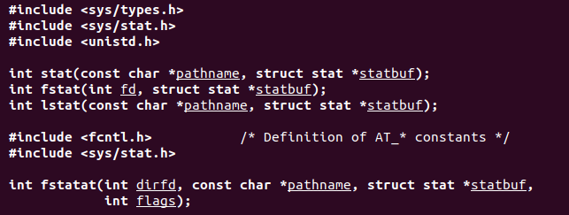
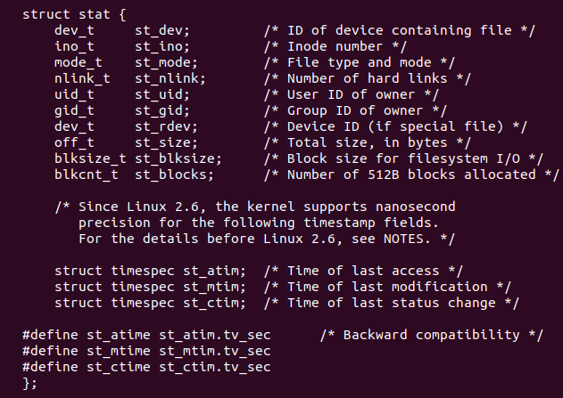
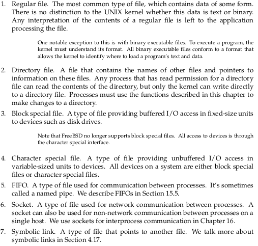
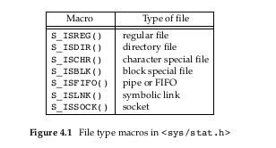
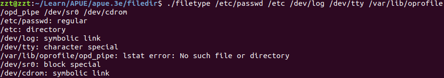

# Files & Directories

## stat



这4个函数都是统计关于文件的信息的，简单说以下他们之间的异同

1. ```fstat``` 与 ```stat``` 相同，不过， ```fstat``` 需要的是打开文件的 ```fd``` 
2. ```lstat```与 ```stat``` 的不同在于 
对于 ```symbol link``` 的文件来说，它只是返回  ```symbol link``` 的信息而不是 ```symbol link``` 指向的文件信息
3. ```fstatat``` 主要还是在于

**struct stat**



## File

**文件类型**



7种文件类型，第3，4，中分别是大学本科课程中所说的块设备和字符设备

上面的```stat``` 结构中的 ```mode_t``` 存储了文件的类型，可以用下面的宏(micro)来判定



**example**

```c
#include "apue.h"

int
main(int argc, char *argv[])
{
	int			i;
	struct stat	buf;
	char		*ptr;

	for (i = 1; i < argc; i++) {
		printf("%s: ", argv[i]);
		if (lstat(argv[i], &buf) < 0) {
			err_ret("lstat error");
			continue;
		}
		if (S_ISREG(buf.st_mode))
			ptr = "regular";
		else if (S_ISDIR(buf.st_mode))
			ptr = "directory";
		else if (S_ISCHR(buf.st_mode))
			ptr = "character special";
		else if (S_ISBLK(buf.st_mode))
			ptr = "block special";
		else if (S_ISFIFO(buf.st_mode))
			ptr = "fifo";
		else if (S_ISLNK(buf.st_mode))
			ptr = "symbolic link";
		else if (S_ISSOCK(buf.st_mode))
			ptr = "socket";
		else
			ptr = "** unknown mode **";
		printf("%s\n", ptr);
	}
	exit(0);
}

```

运行结果与 APUE 有不同， linux 已经有所改变了




# 4.4 Set-User-ID & Set-Group-ID


//没有理解