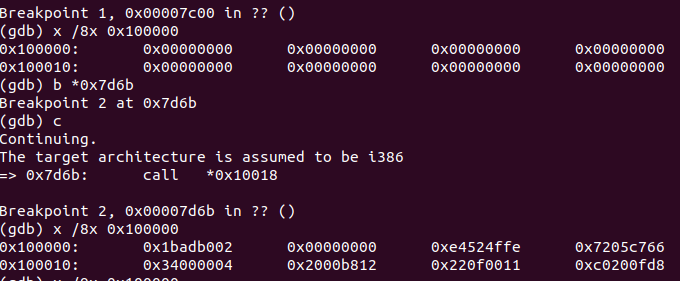
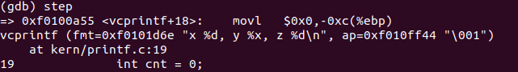
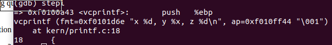
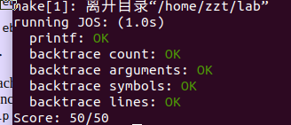

这里是 MIT 6.828 OS lab1 笔记.


简单记录一些有趣，和有意思的东西

# ex6

> Exercise 6. We can examine memory using GDB's x command. The GDB manual has full details, but for now, it is enough to know that the command x/Nx ADDR prints N words of memory at ADDR. (Note that both 'x's in the command are lowercase.) Warning: The size of a word is not a universal standard. In GNU assembly, a word is two bytes (the 'w' in xorw, which stands for word, means 2 bytes).
Reset the machine (exit QEMU/GDB and start them again). Examine the 8 words of memory at 0x00100000 at the point the BIOS enters the boot loader, and then again at the point the boot loader enters the kernel. Why are they different? What is there at the second breakpoint? (You do not really need to use QEMU to answer this question. Just think.)

首先我们看看 ```objdump -h obj/kern/kernel``` 将 kernel 的elf 二进制文件给输出出来看看

```
obj/kern/kernel：     文件格式 elf32-i386

节：
Idx Name          Size      VMA       LMA       File off  Algn
  0 .text         000019e9  f0100000  00100000  00001000  2**4
                  CONTENTS, ALLOC, LOAD, READONLY, CODE
  1 .rodata       000006c0  f0101a00  00101a00  00002a00  2**5
                  CONTENTS, ALLOC, LOAD, READONLY, DATA
  2 .stab         00003b95  f01020c0  001020c0  000030c0  2**2
                  CONTENTS, ALLOC, LOAD, READONLY, DATA
  3 .stabstr      00001948  f0105c55  00105c55  00006c55  2**0
                  CONTENTS, ALLOC, LOAD, READONLY, DATA
  4 .data         00009300  f0108000  00108000  00009000  2**12
                  CONTENTS, ALLOC, LOAD, DATA
  5 .got          00000008  f0111300  00111300  00012300  2**2
                  CONTENTS, ALLOC, LOAD, DATA
  6 .got.plt      0000000c  f0111308  00111308  00012308  2**2
                  CONTENTS, ALLOC, LOAD, DATA
  7 .data.rel.local 00001000  f0112000  00112000  00013000  2**12
                  CONTENTS, ALLOC, LOAD, DATA
  8 .data.rel.ro.local 00000044  f0113000  00113000  00014000  2**2
                  CONTENTS, ALLOC, LOAD, DATA
  9 .bss          00000648  f0113060  00113060  00014060  2**5
                  CONTENTS, ALLOC, LOAD, DATA
 10 .comment      0000002a  00000000  00000000  000146a8  2**0
                  CONTENTS, READONLY

```

VMA 是(link addr),LMA 是 (load addr), 也就是说 kernel 的 .text 也就是代码段全都被加载到 LMA, 而对应的虚拟地址是 VMA, 即后面需将虚地址转化为实地址


```asm
entry:
	movw	$0x1234,0x472			# warm boot
f0100000:	02 b0 ad 1b 00 00    	add    0x1bad(%eax),%dh
f0100006:	00 00                	add    %al,(%eax)
f0100008:	fe 4f 52             	decb   0x52(%edi)
f010000b:	e4                   	.byte 0xe4

```


boot 之后会被 内核就被加载了，即: 在跳转到 内核之前，那一段read代码其实试讲kernel的各个段加载到 0x100000,处，至于为什么要加载在这里呢？lab中说了 **为了保证其内存有> 1M**

# ex8

## 3.

跟踪这段代码，技巧：　将这段代码放在　kernel/monitor.c 中　即可运行
```cpp
int x = 1, y = 3, z = 4;
cprintf("x %d, y %x, z %d\n", x, y, z);
```

```asm
	int x = 1, y = 3, z = 4;
	cprintf("x %d, y %x, z %d\n", x, y, z);
f010089f:	6a 04                	push   $0x4 #z,y,x push in stack 
f01008a1:	6a 03                	push   $0x3
f01008a3:	6a 01                	push   $0x1
f01008a5:	8d 83 66 0a ff ff    	lea    -0xf59a(%ebx),%eax # fmt pointer
f01008ab:	50                   	push   %eax #fmt addr
f01008ac:	e8 c9 01 00 00       	call   f0100a7a <cprintf>

```



可以看到　：　fmt－＞"x %d, y %x, z %d\n"ap 指向的是栈中构造的参数１方的地方，而且如果你实实在在的跟踪并且打印栈中的数据，你会发现参数是倒着来的也就是说先压: z,y,x,fmt,这个可见 asm代码

**ap到底是什么**

看下面两张图，你就会发现 ap 的地址正好等于 ```x```在栈中的地址


(**remark**)
ap_addr = ```x``` 放在栈中的地址 



## 4

```cpp
unsigned int i = 0x00646c72;
cprintf("H%x Wo%s", 57616, &i);
```
57616 = 0xe110


**解释** : 将　57616 转化为16base,->e110,(**这个转化与端系统没有关系，因为代码中是将整数 -> base16，即这个整数是已经被读取出来的结果了**)

后面的 ```"rld\0"``` 是小端机器解释的结果，即解释的是这段ASCII code : 726c6400

# ex9

kernel stack init

```asm

# kernel asm 54 ~ 58 line 
f010002f:	bd 00 00 00 00       	mov    $0x0,%ebp

	# Set the stack pointer
	movl	$(bootstacktop),%esp
f0100034:	bc 00 00 11 f0       	mov    $0xf0110000,%esp
```

栈的最顶部是 放置的数是0(**value**),因此后面打印栈帧的时候只需要判断 ebp =0 结束就好， 接着栈顶是 ```f0110000```

# ex10


# ex11

**!!!!lec2-note**

这个实验没啥难的，只需要看看 lec2-note 就行了，

x86 dictates that stack grows down:

Example instruction	What it does

**pushl** 
>%eax	subl $4, %esp
>
>movl %eax, (%esp)

popl %eax	
>movl (%esp), %eax
>
>addl $4, %esp

call 0x12345	

>pushl %eip (*)
>
>movl $0x12345, %eip (*)

**ret**	popl %eip (*)

注意栈帧 ```esp,ebp``` 表示的栈的范围是 闭区间所以

然后仔细看看 栈帧的图:

```text
+------------+   |
		       | arg 2      |   \
		       +------------+    >- previous function's stack frame
		       | arg 1      |   /
		       +------------+   |
		       | ret %eip   |   /
		       +============+   
		       | saved %ebp |   \
		%ebp-> +------------+   |
		       |            |   |
		       |   local    |   \
		       | variables, |    >- current function's stack frame
		       |    etc.    |   /
		       |            |   |
		       |            |   |
		%esp-> +------------+   /
```

# ex12

wa !!! 

```cpp
**
	// Search within [lline, rline] for the line number stab.
	// If found, set info->eip_line to the right line number.
	// If not found, return -1.
**
```

**注意**这里的right 不是 右的意思，:(,误导我半年...

# 完整代码

## debuginfo_eip

```cpp
stab_binsearch(stabs,&lline, &rline, N_SLINE, addr);
if(lline > rline)return -1;
info->eip_line = stabs[lline].n_desc; //这个可见上面stabs_binsearch 的样例解释
	
```

## mon_bactrace

```cpp
int
mon_backtrace(int argc, char **argv, struct Trapframe *tf)
{
	// Your code here.ex11
	uint32_t * ebp = (uint32_t *)read_ebp();
	while(ebp !=0){
		cprintf("ebp %08x",ebp);
		uint32_t eip = ebp[1];
		cprintf("  eip %08x  args",eip);
		uint32_t *args = ebp+2;
		for(int i = 0 ; i<5 ; ++i)
			cprintf("  %08x",args[i]);
		cputchar('\n');
		struct Eipdebuginfo info;
		debuginfo_eip(eip,&info);
		cprintf("%s:%d: %.*s+%d\n",info.eip_file,info.eip_line,info.eip_fn_namelen,info.eip_fn_name,eip - info.eip_fn_addr);
		ebp = (uint32_t *) ebp[0];
	}
	return 0;
}
```

# 最终成果:



**我没有做 challenge**

# 总结

我做过 清华的ucore,也做过JOS 所以想在这里如实对比一下:

- JOS 更难,但探索的更仔细
- ucore 稍微简单一些，只包含7个ex左右
- 但是我想说的是 ucore我没做出来，这个JOS我做出来了，我觉得主要原因是 JOS lab提示更直接，整个lab一气呵成，照着做一定能做出来，资源也是就附着在链接里，比 Ucore 更容易获取，而且概念解释更详细，没有涉及 GDT ldt 之类的一来就把人下跑了

# ref

[2018/lab1](https://pdos.csail.mit.edu/6.828/2018/labs/lab1/)
[Xin Qiu - MIT 6.828 Lab1)(https://xinqiu.me/2016/10/15/MIT-6.828-1/)