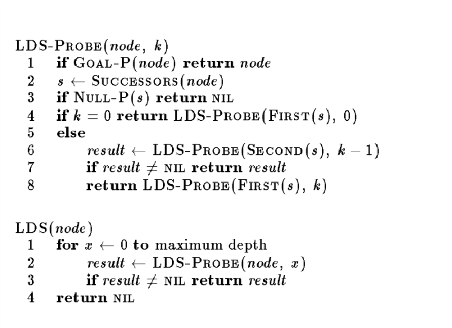

# java 代码的坑

1. solverJava.py 运行java文件 如果显示 ```can not load or find main class``` 应该是需要在环境变量 classpath 中添加 ```.;``` 即当前目录，这个具体可以参见[爆栈答案](https://stackoverflow.com/questions/18093928/what-does-could-not-find-or-load-main-class-mean)
2. 我在```solverJava.py``` 中加了```os.system("javac .\Solver.java")``` 这行代码，使得`.java` 文件每次都能都被重新编译

3. 重构了 solver 方法，提供一个接口 使得不同的算法只需要提供 solve方法即可

4. java 设置最大栈 -Xss20M 解决栈溢出问题， 在用搜索法解决这个问题的时候很有用 

# knapsack 问题算法

## dp

这个方法很简单，以前学过

$dp[k][j] = \max \{dp[k][j-1],values[j] + dp[k-weights[j]][j-1]\}$

但是要注意，因为要求出 `taken[i]` 即第 $i$ 个单元是否 $taken$ 故用一维数组无法求出答案

dp 可以解决 1,2,3,5 got 40 scores

## LDS

算法



详细解释可见其中两篇参考文献

- [lds_expanded.pdf](./paper/lds_expanded.pdf)
- [LDS raw paper](./paper/limited-disperancy-search.pdf)

这个启发式算法的思路主要是一点:

假设某一个分支能获取答案的概率是 $p$,(这里是 $taken[i] = 1$这个分支),而另外一个分支是 $1-p$,其中 $p >0.5$ 因此我们按照概率优先进行访问，即，让让 $1-p$ 的分支，先访问一个，两个,...,  这就是视屏中所说的wave


但是这个启发式算法并没有起到很大的作用仅仅 got 3 scores


